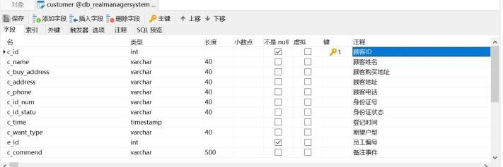
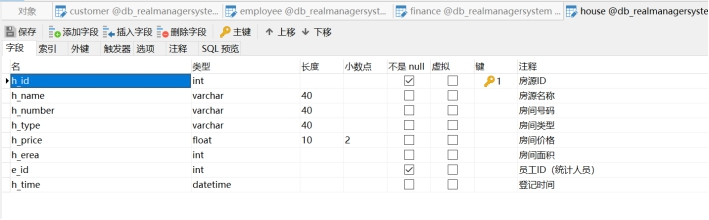

# RealManageSystem

## 1.绪论

### 1.1系统开发背景

随着城市化进程的推进和社会经济的发展，房地产行业得到了长期稳定的发展，涌现出了一大批知名的房地产开发商，与此同时在房地产销售领域也产生了许多新的营销手段和销售工具，房屋销售不再仅仅是简单的付钱和交房。对交易衍生信息的管理和对房产资源的管理也日趋重要。在信息飞速传播的今天，互联网和计算机的广泛应用使得销售管理方法得到了进 一步的进化升级。传统的房地产销售过程不仅包括复杂冗长的前期销售过程，还包括交易完成后的各项纸质协议的签订、备份、统计和储存。在交易完成后如果需要对已完成房屋进行后续处理，还需要通过翻找堆积如山的备份查料进行处理，这将耗费很多的时间和精力。现代房产销售需要通过对某一房屋的资料整合使其能在最短的时间内被销售人员以最完整的状态调用并呈现在顾客的面前，通过对顾客信息的采集和储存使得房销售能得到长久的延续，保证稳定的潜在顾客群体。在销售员调用资料时不必再翻阅堆积的纸质资料，在联系顾客时不必要再查找电话簿，在统计数据时不必要再对应着账单一项项输入。所以传统的房地产管理已不再适应当前的房地产销售,为了使得售楼工作简单明了，提高工作效率，降低企业成本特此研究开发了开发商楼盘管理系统。

### 1.2本课题研究的目的及意义

随着科技、文化和经济的发展，人们的生活水平得以提高，人们的精神需求和物质需求无论在观念还是在实质上都较以前有了飞跃的进步，房子一直人们不变的话题，已至房地产行业发展迅速，想在城市安家是可以，可是买房却不是件容易的事，尽管有许多的楼盘消息，但是要买到能够使自己满意的房屋，是有点难度的事。

在此时科学技术的发展显得格外重要了，因为科技的发展同样给房地产业的发展提供了便利，利用系统的先进管理手段, 把售楼人员从纸质化办公模式中解放出来，将楼盘的销售推向“无纸化”已成为解决当前楼盘销售的当务之急，开发一个房地产销售管理系统尤为重要，对于管理人员来说，通过该系统可以及时了解楼盘的动态销售情况, 还能充分利用电脑的可检索性，方便、快捷地查询有关销售楼盘的各种详细资料。 对于购房客户来说，它可以为人们买房省去多余程序，花最短时间购置满意的房屋。

### 1.3开发工具及相关技术

#### 1.3.1 Navicat/Eclipse简介

（1）Navicat是一套可创建多个连接的数据库管理工具，用以方便管理MySQL、SQL Server等不同类型的数据库，可以创建、管理和维护数据库。Navicat的用户界面 (GUI) 设计良好，以安全且简单的方法创建、组织、访问和共享信息。Navicat可以建立多个数据库连接，可快速建表，更易于的数据查看，数据库的导入导出更加便捷。能清楚的理清表与表之间关系，还有视图，函数，事件，查询，报表等。可进行数据库备份，创建设计数据库模型，生成报表，计划批量作业等功能。

（2）Eclipse 是一个开放源代码的、基于Java的可扩展开发平台。就其本身而言，它只是一个框架和一组服务，用于通过插件组件构建开发环境。Eclipse 附带了一个标准的插件集，包括Java开发工具（Java Development Kit，JDK）。Eclipse 框架还可以用来作为其他应用程序类型的基础，基于Eclipse的应用程序的一个突出例子是 IBM Rational Software Architect，它构成了 IBM Java 开发工具系列的基础。
	
## 2.系统分析与设计

### 2.1需求分析

通过对一些典型楼盘销售系统的考查、分析以及实际的市场调查与研究，要求本系统具有以下功能:

（1）统一、友好的操作界面，为以保证系统的易用性。

（2）规范、完善的基础信息位置，对基础信息进行全面管理。

（3）对财务管理实现相对应的统计功能。

（4）对员工、顾客及各种楼盘信息按不同要求实现增、删、改、查功能。

#### 2.1.1系统的主要功能

（1）基础数据维护包括楼盘资料信息、客户信息、财务信息、楼房销售人员基本信息。

（2）楼盘管理部分包括户型登记、楼盘登记、户型和楼盘的查询。

（3）客户管理主要进行客户资料的登记和客户资料的查询。

（4）财务管理人员对收费进行查询和登记。

（5）楼房销售管理部分包括楼房销售人员的登记、楼房销售合同的管理、收款管理、楼房销售合同的查询以及收款情况查询。

#### 2.1.2系统的实现目标

（1）减少人工的参与和基础信息的录入,具有良好的自治功能和信息循环。

（2）能够方便地管理客户资料。

（3）能够管理所有的房屋信息，包括楼房信息和房间信息。

（4）能够快速地进行房屋信息的查询。

#### 2.1.3系统的性能需求

（1）系统的可靠性

系统应具有较高的稳定性，综合可靠性包括从服务器、信息管理中所有环节正常运行。

（2）系统的易用性、简单性

该系统用户界面操作简洁、易用、灵活、风格统一。

#### 2.1.4运行环境

（1）操作系统：windows10系统 

（2）数据库：MySQL+Navicat 

（3）Web服务器：Tomcat8.5版本 

（4）浏览器：Chrome、Microsoft Edge

### 2.2系统功能设计

#### 2.2.1系统功能设计模块图

房地产信息管理系统的功能很多，系统大而复杂，设计起来非常繁琐，尤其是销售部分，相互关联的部分很多，窗口套窗口。所以在设计之前，要把模块之间的关系梳理清除。

系统由用户信息、客户信息、楼盘信息和财务信息四个大的功能模块组成。


1. 客户信息

客户信息模块主要通过对客户信息的管理、查询，通过对系统需求分析的研究，置业顾问登录后对客户信息进行增加、删除、修改。更详细的来讲就是对客户信息进行管理，实现对客户信息的综合管理。具体的流程如图2-2所示：


2. 房屋信息

房屋信息管理模块主要通过对房屋信息的管理、查询，通过对系统需求分析的研究，置业顾问登录后对房屋信息进行增加、删除、修改。更详细的来讲就是对房屋信息进行管理，实现对房屋信息的综合管理。具体的流程如图2-3所示：


#### 2.2.3基本功能设计

主要实现的是开发商楼盘销售管理系统，尽可能的贴近售楼人员、便于售楼人员操作。系统在实现上应该具有以下功能：

（1）员工、客户、房源和财务信息统一管理及信息的录入、删除、修改、查询；

（2）财务信息的详细展示及实现各项统计功能。

（3）数据库的自动备份。

## 3.数据库设计与实施

### 3.1数据库设计

#### 3.1.1 E-R模型设计

（1）房源E-R图


（2）财务E-R图


（3）用户E-R图


（4）客户E-R图


#### 3.1.2表/字段及表间关系设计

（1）客户表

| 字段名称      | 字段类型    | 是否为空 | 约束 | 字段说明   |
| ------------- | ----------- | -------- | ---- | ---------- |
| c_id          | int         | 否       | 主键 | 顾客id     |
| c_name        | varchar(40) | 否       |      | 顾客姓名   |
| c_buy_address | varchar(40) | 否       |      | 购买地址   |
| c_address     | varchar(40) | 否       |      | 顾客地址   |
| c_phone       | varchar(40) | 否       |      | 顾客电话   |
| c_id_num      | varchar(40) | 否       |      | 身份证号   |
| c_id_statu    | varchar(40) | 否       |      | 身份证状态 |
| c_time        | timestamp   | 否       |      | 登记时间   |
| c_want_type   | varchar(40) | 否       |      | 期望户型   |
| e_id          | int         | 否       |      | 员工编号   |
| c_commend     | varchar(40) | 否       |      | 备注       |

（2）员工表

| 字段名称     | 字段类型    | 是否为空 | 约束· | 字段说明 |
| ------------ | ----------- | -------- | ----- | -------- |
| e_id         | int         | 否       | 主键  | 员工id   |
| e_name       | varchar(40) | 否       |       | 员工姓名 |
| e_username   | varchar(40) | 否       |       | 员工昵称 |
| e_gender     | varchar(40) | 否       |       | 员工性别 |
| e_age        | varchar(40) | 否       |       | 员工年龄 |
| e_phone      | varchar(40) | 否       |       | 员工电话 |
| e_department | varchar(40) | 否       |       | 员工部门 |
| e_position   | varchar(40) | 否       |       | 员工职位 |
| e_salary     | float       | 否       |       | 员工工资 |

（3）财务表

| 字段名称        | 字段类型    | 是否为空 | 约束· | 字段说明 |
| --------------- | ----------- | -------- | ----- | -------- |
| c_id            | int         | 否       | 主键  | 顾客id   |
| e_id            | int         | 否       |       | 员工id   |
| f_price         | float       | 否       |       | 付款金额 |
| f_payment_way   | varchar(40) | 否       |       | 收款方式 |
| f_type          | varchar(40) | 否       |       | 财务类型 |
| f_time          | timestamp   | 否       |       | 财务时间 |
| f_payment_amout | float       | 否       |       | 付款金额 |
| f_laon_amout    | float       | 否       |       | 贷款金额 |
| f_bank_name     | varchar(40) | 否       |       | 银行名称 |


（4）房源表

表3-4房源表

| 字段名称 | 字段类型    | 是否为空 | 约束· | 字段说明 |
| -------- | ----------- | -------- | ----- | -------- |
| h_id     | int         | 否       | 主键  | 房源id   |
| h_name   | varchar(40) | 否       |       | 房源名称 |
| h_number | varchar(40) | 否       |       | 房间号码 |
| h_type   | varchar(40) | 否       |       | 房间类型 |
| h_price  | float       | 否       |       | 房间价格 |
| h_erea   | int         | 否       |       | 房间面积 |
| e_id     | int         | 否       |       | 员工id   |
| h_time   | date        | 否       |       | 登记时间 |

#### 3.1.3创建表关联视图

通过MySQl企业管理器可以得到数据库表的关联图,使用连线来表示事物相互关系。在数据库中, 各个表之间的关系是通过使用主外键来维护的,所有的主键表和外键表对Insert和 Update 具有强制性，同时具有级联删除相关记录的特征。各表的关联关系视图如下图3-5所示：


### 3.2数据库的实施

#### 3.2.1数据库连接代码

首先创建驱动对象，并进行注册，第二步进行获取连接，获取后要关闭连接。第三步创建对象，并发送SQL语句到数据库服务器。第四步执行语句，处理结果，最后释放资源。

```java
public class sqlHelper {
    // 连接信息
    private static final String URL = "jdbc:mysql://localhost:3306/db_realmanagersystem?serverTimezone=UTC";
    private static final String DRIVERCLASS = "com.mysql.cj.jdbc.Driver";
    private static final String USERNAME = "root";
    private static final String PASSWORD = "123456";
    // 数据库操作变量
    private static Connection con = null;
    private static ResultSet rs = null;
    private static Statement stmt = null;
    private static PreparedStatement pstmt = null;
    private static int rows = 0;
    /* 建立连接*/
    public static Connection getConnection() throws Exception {
        // 注册驱动
        Class.forName(DRIVERCLASS);
        // 获得连接
        con = DriverManager.getConnection(URL, USERNAME, PASSWORD);
        return con;
    }
    /* 释放资源 */
    public static void close() throws Exception {
        if (rs != null)
            rs.close();
        if (stmt != null)
            stmt.close();
        if (pstmt != null)
            pstmt.close();
        if (con != null)
            con.close();  
    }
```


#### 3.2.2数据库的建表语句

员工信息表和财务信息表是由其他两位组员负责，我主要负责顾客信息表和房屋信息表，建表内容如下：

（1）顾客信息表

```sql
CREATE TABLE `customer` (
    `c_id` int(10) NOT NULL AUTO_INCREMENT COMMENT '顾客ID',
    `c_name` varchar(40) DEFAULT NULL COMMENT '顾客姓名',
    `c_buy_address` varchar(40) DEFAULT NULL COMMENT '顾客购买地址',
    `c_address` varchar(40) DEFAULT NULL COMMENT '顾客地址',
    `c_phone` varchar(20) DEFAULT NULL COMMENT '顾客电话',
    `c_id_num` varchar(20) DEFAULT NULL COMMENT '身份证号',
    `c_id_statu` varchar(5) DEFAULT NULL COMMENT '身份证状态',
    `c_time` timestamp NOT NULL DEFAULT CURRENT_TIMESTAMP ON UPDATE CURRENT_TIMESTAMP COMMENT '登记时间',
    `c_want_type` varchar(40) DEFAULT NULL COMMENT '期望户型',
    `e_id` int(10) NOT NULL COMMENT '员工编号',
    `c_commend` varchar(500) DEFAULT NULL COMMENT '备注事件',
    PRIMARY KEY (`c_id`)
) ENGINE=InnoDB AUTO_INCREMENT=7 DEFAULT CHARSET=utf8;

insertinto`customer`(`c_id`,`c_name`,`c_buy_address`,`c_address`,`c_phone`,`c_id_num`,`c_id_statu`,`c_time`,`c_want_type`,`e_id`,`c_commend`)
values (1,'张三丰','河北张家口','河北邯郸','12312312','1231312341','已认证','2022-06-22 18:49:38','学区房',2,'这是备注'),
    (2,'赵敏','河北张家口','河北邯郸','12312','7918379','已认证','2022-06-22 18:49:46','学区房',1,'无'),
    (3,'张无忌','河北张家口','河北石家庄','23132132','23121321','未认证','2022-06-22 18:49:53','公寓',3,'无'),
    (4,'周芷若','河北张家口','河北石家庄','23123','231321231','已认证','2022-06-22 18:49:59','公寓',4,'无');
```



（2）房源信息表

```sql
CREATE TABLE `house` (
    `h_id` int(10) NOT NULL AUTO_INCREMENT COMMENT '房源ID',
    `h_name` varchar(40) DEFAULT NULL COMMENT '房源名称',
    `h_number` varchar(40) DEFAULT NULL COMMENT '房间号码',
    `h_type` varchar(40) DEFAULT NULL COMMENT '房间类型',
    `h_price` float(10,2) DEFAULT NULL COMMENT '房间价格',
    `h_erea` int(5) DEFAULT NULL COMMENT '房间面积',
    `e_id` int(10) NOT NULL COMMENT '员工ID（统计人员）',
    `h_time` datetime DEFAULT NULL COMMENT '登记时间',
    PRIMARY KEY (`h_id`)
) ENGINE=InnoDB AUTO_INCREMENT=7 DEFAULT CHARSET=utf8;

insertinto`house`(`h_id`,`h_name`,`h_number`,`h_type`,`h_price`,`h_erea`,`e_id`,`h_time`) 
values (1,'A栋','1234','教学区',12.00,100,1,'2022-10-10 00:00:00'),
    (3,'A005','100','商品房',100.00,100,1,'2022-06-20 00:00:00'),
    (4,'A003','100','商品房',100.00,100,1,'2022-06-20 00:00:00');
```



## 4.系统开发

### 4.1顾客管理模块

员工信息管理模块和财务信息管理模块是由其他两位组员负责，我主要负责顾客信息管理模块和房屋信息管理模块。

顾客信息管理模块，如图所示，这个功能可以实现对客户信息增加、删除、查询和修改功能。顾客信息管理模块主要包括顾客的姓名、家庭地址、电话号码、身份证号、身份证状态、他们所希望的楼盘类型以及负责跟他们对接的置业顾问。

客户被录入到客户信息公共池进行专属置业顾问的分配，由置业顾问对所属客户信息进行完善 为销售团队带来公平的机制，防止撞单、抢单等现象，也避免了人员流动导致的客户资源的流走或错位，是避免客户流失的一个重要客户管理模块。

（1）顾客信息界面

销售部人员在操作页面时需要对顾客信息进行查看，所以通过连接后台数据库

```js
window.onload = function() { 
    initData(); 
    changCustomer();
}
// 默认查看顾客信息，首次进入获取数据
function initData() {
    MyAjax("Customer ", "queryAll", "", function(result) {
        var rst = eval("(" + result + ")");
		var customer = rst.message;
     	......
    });
}
```

前端通过CSS对界面进行美化,形成顾客信息界面：


（2）添加顾客信息界面

```js
function addcustomer() {
    form.reset();
    // 绑定单击事件
    form.btn.value = "添加";
    form.btn.onclick=function() {
        // 获取客户信息的填
        var name = form.cname.value;
        var address = form.caddress.value;
        var buyaddress = form.cbuyaddress.value;
        var phone = form.cphone.value;
        var idnum=form.cidnum.value;
        var idstatu= form.cidstatu.value;
        var wanttype=form.cwanttype.value;
        var eid=form.eid.value;
        var commend=form.ccommend.value;
        if(!(name && address && buyaddress && phone && idnum&& idstatu&& wanttype && eid && commend)) {
            alert("请将数据填写完整后重新提交！");
            return;
        } else {
            // 创建相应的标签将用户提交的信息放入其中
            var values="&name="+name+ "&address="+address+"&buyaddress="+buyaddress+"&phone="+phone+"&idnum="+ idnum+ "&idstatu=" + idstatu + "&wanttype=" + wanttype + "&eid="+ eid + "&commend=" + commend;
            ......
        }
    }
}
```

再经过Ajax连接前端跟后端，实现顾客信息的添加：

在对数据进行录入时：

1）对顾客编号输入的内容做了设置：

2）对顾客电话输入的内容做了设置：只能输入数字，并且数字只能11位，大于或者小于11位都不能保存且给出用户提示前台input代码：

```html
<input type="number" name="" id="number" min = 11 >
```

```js
document.getElementById("number").addEventListener("input",function(event){
    event.target.value = event.target.value.replace(/\-/g,"");
});
```

3）对顾客身份证号码输入的内容做了设置：只能输入数字或者X，要么数字只能18位，要么17位数字，末尾加X，一共也是18位，大于或者小于18位都不能保存且给出用户提示。前台input代码：

```html
<input type="number" name="" id="number" min = 18 >
```

添加顾客信息图


 


（3）修改顾客信息界面

管理员在数据添加错误时，系统也支持修改工作。首先显示要修改的原始数据：

```js
document.getElementsByClassName("dialog-reginster-customer")[0].style.display = "block";
var form = document.getElementById("dialog-login-customer");
// <form>表单是前后端交互的重要标签，循环遍历：
form.reset();
var cus;for (var i = 0; i < customers.length; i++) {
    if (customers[i].id == id) {
        cus = customers[i];
        ......
    }
}
```

修改成功如下图所示：


### 4.2楼盘管理模块

楼盘信息模块，如图所示，这个功能可以实现楼盘信息的增加、删除、查询和修改功能。楼盘信息包括楼盘名称、楼号、楼盘类型、单价、面积，还可以查询到具体是哪一位置业顾问负责的楼盘。

前端页面通过HTML来实现，使用<div>标签把页面划分成不同的模块，结合<span>和<option>等标签对页面进行定义。

（1）楼盘信息界面

销售部人员在操作页面时需要对楼盘信息进行查看，所以通过连接后台数据库

```js
window.onload = function() { 
    initData(); 
    changeHouse();
}
// 默认查看楼盘信息，首次进入获取数据：
function initData() {
    MyAjax("employee", "queryAll", "", function(result) {
        var rst = eval("(" + result + ")");
        Houses = rst.message;
        ......
    });
}
```

前端通过CSS对界面进行美化,形成楼盘信息界面：


 

图4-4楼盘信息管理模块图

（2）添加楼盘信息界面

```js
function addHouse() {
    form.reset();
    // 绑定单击事件
    form.btn.value = "添加";
    form.btn.onclick = function() {
        // 获取用户房屋信息的填写
        var name = form.hname.value;
        var number = form.hnumber.value;
        var type = form.htype.value;
        var price = form.hprice.value;
        var erea = form.herea.value;
        var eid = form.eid.value;
        var time = form.htime.value;
        if (!(name && number && type && price && erea && eid && time)) {
            alert("请将数据填写完整后重新提交！");
            // 创建相应的标签将用户提交的信息放入其中，
            var values = "&name=" + name + "&number=" + number + "&type=" + type+ "&price=" + price + "&erea=" + erea + "&eid=" + eid+ "&time=" + time;
            ......
        }
    }
}
```

再经过Ajax连接前端跟后端，实现楼盘信息的

在对数据进行录入时：

1）对楼盘编号输入的内容做了设置：

2）对楼盘价格输入的内容做了设置：只能输入数字，并且数字只能为正数，输入非数字将不显示在文本框中，输入负数会显示它的相反数。前台input代码：

```html
<input type="number" name="" id="number" min = 0 >
```

前台js代码：

```js
document.getElementById("number").addEventListener("input",function(event){
    event.target.value = event.target.value.replace(/\-/g,"");
    ......
});
```

3）对楼盘面积输入的内容做了设置：只能输入数字，并且数字只能为正数输入非数字将不显示在文本框中，输入负数会显示它的相反数。


（3）修改楼盘信息界面

管理员在数据添加错误时，系统也支持修改工作。首先显示要修改的原始数据：

```js
document.getElementsByClassName("dialog-reginster-house")[0].style.display = "block";
var fordocument.getElementById("dialog-login-house");

// 表单是前后端交互的重要标签，循环遍历：
form.reset();
var hou;for (var i = 0; i < houses.length; i++) {
    if (houses[i].id == id) {
        hou = houses[i];
        // 为提交按钮绑定单击事件：
        form.btn.onclick = function() {
            ......
        }
    }
}

// 获取用户的信息：
var id = form.hid.value;
var name = form.hname.value;
var number = form.hnumber.value;
var type = form.htype.value;
var price = form.hprice.value;
var erea = form.herea.value;
var eid = form.eid.value;
var time = form.htime.value;
if (!(name && number && type && price && erea && eid && time)) {
    alert("请将数据填写完整后重新提交！");
    // 创建相应的标签将用户提交的信息放入其中：
    var values = "&id=" + id + "&name=" + name + "&number=" + number+ "&type=" + type + "&price=" + price + "&erea=" + erea+ "&eid=" + eid + "&time=" + time;
    ......
}
```

修改成功如下图所示：


### 4.3员工管理模块


### 4.4财务管理模块

财务模块对客户购房的信息进行了详细的登记及增删查改，对置业顾问的销售业绩进行了统计，同时将回款记录以扇图的形式展现出来，以便于更清楚的看到销售额度和贷款金额、付款金额。下图是财务管理界面：

账务信息界面


 

销售统计界面


 

付款统计界面


 

贷款统计界面


